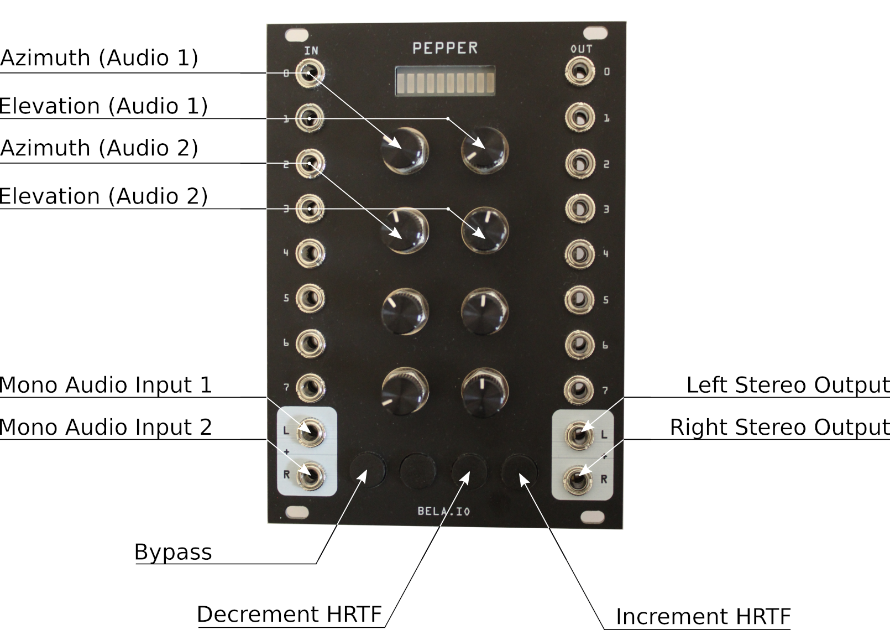

SOFAlizer-for-Bela is a real-time audio spatialization system for headphone-based sound reproduction implemented for the Bela hardware. It is embedded into Bela’s environment for real-time processing and utilizes the [libmysofa](https://github.com/hoene/libmysofa) library. Latter is a set of C functions to read AES SOFA files, if they contain HRTF data sets according to the [AES69-2015 standard](https://www.aes.org/publications/standards/search.cfm?docID=99).
It is intendend to be a customizable open source framework for audio spatialization.

The software filters audio inputs using head-related transfer functions (HRTFs) to create immersive spatial audio effects. To optimize performance, fast convolution techniques are employed, leveraging the ARM Cortex-A8's NEON co-processor for efficient computation of FFT, IFFT, and complex multiplication. SOFAlizer-for-Bela has been tested successfully with configurations of up to 41 virtual loudspeakers per channel when using a block size and hop size of 128, and up to 36 virtual loudspeakers per channel with a block size and hop size of 256.

Two distinct interfacing methods are offered. The analog interface is tailored to the [Pepper shield](https://eu.shop.bela.io/products/pepper), effectively transforming Bela into a Eurorack compatible modular synth module. Alternatively, network-based interfacing is achieved through Open Sound Control (OSC). The choice of interface is mutually exclusive and must be selected pre compile time.

# Table of Contents
1. [Bela Setup](#belasetup)\
    1.1 [Connect to Bela](#connect)\
    1.2 [SSH conntection](#ssh)\
    1.3 [Install libmysofa](#installlib)

2. [Manual](#manual)\
    2.1 [Settings](#settings)\
    2.2 [Interfaces](#interfaces)\
        2.2.1 [OSC Interface](#osc_interface)
        2.2.2 [Analog Interface](#analog_interface)

3. [Development](#dev)\
    3.2 [Setup Visual Studio Code](#vscode)\
    3.3 [Cross Compilation on Debian Machine](#crosscompile)

# Bela Setup <a name="belasetup"></a>

This chapter explains how to setup SOFAlizer-for-Bela on a Bela hardware. It should also run on Bela Mini, but has not been tested.

## Connect to Bela <a name="connect"></a>
There are several ways to connect to your Bela device. The following setup procedures utilize an internet connection on the Bela device, which is only available when connecting via Ethernet or Wifi. If you are running MacOS you can also share internet over USB with Bela (please refer to [this](https://learn.bela.io/using-bela/bela-techniques/connecting-to-wifi/#sharing-internet-over-usb-with-bela-mac-os-x) tutrioal).

1. **Access via USB** (without internet connection on Bela)\
Bela can function as a USB network device when connected to a computer, which can be useful in the field for e.g. sending OSC messages without the need of a network.\
If you are running a linux distro, no driver installation is required and Bela is available via `192.168.7.2`. 
If you are running Windows or MacOS additional drivers are needed and the IP address may differ. Please refer to [Bela's network-setup tutorial](https://learn.bela.io/using-bela/bela-techniques/network-setup/) for detailed information on how to USB connect via Windows or MacOS.

2. **Access via Ethernet** (with internet connection on Bela)\
When Bela is connected to a network via Ethernet it should be available from any computer within the same network. On linux you can scan the network via nmap, f.e. `nmap -sn 192.168.0.*` lists all devices (host addresses) within th network address.

3. **Connect via Wifi** (with internet connection on Bela)\
In order to connect your Bela device via Wifi, a Wifi dongle is required. I used the [TP-Link Archer T2U Nano AC600](https://www.amazon.de/gp/product/B07KRCW6LZ/ref=ppx_yo_dt_b_asin_title_o05_s00?ie=UTF8&psc=1). Please refer to [Bela's connecting-to-Wifi tutorial](https://learn.bela.io/using-bela/bela-techniques/connecting-to-wifi/) for detailed instructions on how to connect your Bela device to Wifi and additional compatable Wifi dongles.

4. **Bela as Wifi access point** (without internet connection on Bela)\
It is also possible to setup your Bela device as a wireless access point, which can be useful in the field for e.g. sending OSC messages without the need of a network. Please refer to [this](https://learn.bela.io/using-bela/bela-techniques/connecting-to-wifi/#using-bela-as-a-wi-fi-hotspot) tutorial on how to set it up.\
**Note:** I have not tested it yet

## SSH Connection <a name="ssh"></a>
After successfully connecting your Bela device to a network, let's connect to it via [SSH](https://en.wikipedia.org/wiki/Secure_Shell). If you are running a Linux or MacOS computer type `$ ssh root@IP-ADRESS-OF-BELA` in the terminal (e.g. `$ ssh root@192.168.7.2` in case you are running Linux and have connect to Bela via USB).
If you are running a Windows computer, you can either use the [built-in SSH client](https://learn.microsoft.com/en-us/windows/terminal/tutorials/ssh) or a third party software, such as [PuTTY](https://www.putty.org/).

## Install libmysofa <a name="installlib"></a>
**SOFAlizer-for-bela** relies on [libmysofa](https://github.com/hoene/libmysofa). I have used version (**TODO:** add commit number).

- Make sure that Bela has an internet connection and is reachable via an remote computer.
- Connect to Bela via ssh
- Once connected to the Bela device, perform following steps on it:

    - Clone libmysofa from: `https://github.com/hoene/libmysofa` into `~/Bela/projects`\
    (you can clone into any other folder, but make sure to adapt following steps if you do so):
        - `$ cd ~/Bela/projects`
        - `$ git clone https://github.com/hoene/libmysofa.git`

    - Install required components via apt
        - `$ apt install zlib1g-dev libcunit1-dev`

    - Compile libmysofa
        - `$ cd ~/Bela/projects/libmysofa/build`
        - `$ cmake -DCMAKE_BUILD_TYPE=Release ..`
        - `$ make all test`\
            (My output: (Total Test time (real) = 1505.02 sec; failed:  34 - TU-Berlin_QU_KEMAR_anechoic_radius_0.5_1_2_3_m))
    - Copy `libmysofa.a` from `build/src` to `/usr/local/lib`
        - `$ cp /root/Bela/projects/libmysofa/build/src/libmysofa.a /usr/local/lib`


## Install SOFAlizer-for-bela

(**TODO:** change github links once published - now not available, because it is private)

- Make sure that Bela has an internet connection and is reachable via an remote computer.
- Connect to Bela via ssh
- Once connected to the Bela device, perform following steps on it:

    - Clone SOFAlizer-for-bela from: `https://github.com/MaxBauV/SofalizerForBela/tree/main` into `~/Bela/projects`
        - `$ cd ~/Bela/projects`
        - `$ git clone https://github.com/MaxBauV/SofalizerForBela.git`

- On the remote computer open Bela's IDE by either typing Bela's IP-address or `bela.local` in a browser
- Tell the linker to link *libmysofa* and *zlib*
    - In Bela IDE type <br> `LDLIBS=-lmysofa /usr/lib/arm-linux-gnueabihf/libz.a;` <br> into the *Make Parameters* box


# Manual <a name="manual"></a>

## Settings <a name="settings"></a>

All relevant settings can be found in `settings.h`. The settings are pre-compiler macros. The program must be re-compiled in order to apply the modifications.


## Interfaces <a name="interfaces"></a>

Two methods for interfacing are provided. The analog interface is developed to comply with the [Pepper shield](https://eu.shop.bela.io/products/pepper) and converts Bela into an Eurorack compatible modular synth module.
The other interface method utilizes Open Sound Control (OSC) for a network-based interfacing. The choice of the interface is mutually exclusive and must be selected prior to compile time. You can choose the interface by setting the `INTERFACE` (found in `settings.h`) macro to `ANALOG` or `OSC`.
Common control options for both interfaces are:

- Set azimuth and elevation angle for left channel audio input 
- Set azimuth and elevation angle for right channel audio input
- Select 1 of the loaded HRTF data sets
- Bypass Filtering mode

### Analog Interface <a name="analog_interface"></a>




### OSC Interface <a name="osc_interface"></a>

The OSC interface method offers additional control options.

|  OSC Command Address | Argument Types | Command Argument Description|
|-------------------------|-------------------|-----------------------------------------------|
| /system/filtering       | bool              | True: enable filtering process                |
|                         |                   | False: bypassing filtering process            |
| /position/set/angle/0   | float,            | Azimuth for Position 0 (degree)               |
|                         | float             | Elevation for Position 0 (degree)             |
| /position/set/angle/1   | float,            | Azimuth for Position 1 (degree)               |
|                         | float             | Elevation for Position 1 (degree)             |
| /position/set/norm/0    | float,            | Azimuth for Position 0 (range 0..1)           |
|                         | float             | Elevation for Position 0 (range 0..1)         |
| /position/set/norm/1    | float,            | Azimuth for Position 1 (normalized to 0..1)   |
|                         | float             | Elevation for Position 1 (normalized to 0..1) |
| /position/get/angle/0   | bool              | True: Get Position 0                          |
|                         |                   |                                               |
| /position/get/angle/1   | bool              | True: Get Position 1                          |
|                         |                   |                                               |
| /hrtf/select            | int               | Select \ac{HRTF} data set                     |
| /hrtf/inc               | bool              | True: Increment \ac{HRTF} data set by one     |
| /hrtf/dec               | bool              | True: Decrement \ac{HRTF} data set by one     |

| OSCFeedback Address | Return Value Types | Return Value Description |
|--------------------------|-----------------------|----------------------------------------------------------|
| /system/status           | string                | Status of SOFAlizer-for-Bela is streamed to this address |
| /position/0              | float,                | Azimuth of Position 0 (degree)                           |
|                          | float                 | Elevation of Position 0(degree)                          |
| /position/1              | float,                | Azimuth of Position 1 (degree)                           |
|                          | float                 | Elevation of Position 1(degree)                          |
| /hrtf/num                | int                   | Number of currently selected \ac{HRTF} data set          |
| /hrtf/filename           | string                | Filename of currently selected \ac{HRTF} data set        |

# Development <a name="dev"></a>

## Setup Visual Studio Code <a name="vscode"></a>

It is possible to remotely develop via `ssh` with Visual Studio Code. Please refer to [this guide](https://code.visualstudio.com/docs/remote/ssh).

## Cross Compilation on Debian Machine <a name="crosscompile"></a>

**Note:** This is information I've gathered on how to cross-compile Bela software in general. It has only been used to test specific applications. SOFAlizer-for-Bela has not been cross-compiled. The following instructions might be missing information on how to cross-compile SOFAlizer-for-Bela.

- Clone `xcBela` from `https://github.com/thetechnobear/xcBela` into the home directory of your linux machine
<br> (you can clone into any other folder, but make sure to adapt following steps if you do so).
    - I used Commit e8d4b029cf48bd717ac4d11a3451de6f9711a903
    - `$ cd ~`
    - `$ git clone https://github.com/TheTechnobear/xcBela.git`
    - (There is no need to clone with the `--recurse-submodules` parameter, as the install script will clone the Bela core anyway)

- The resourced given in `~/xcBela/install/install_linux.sh` might be outdated, therefore replace them with newer version.
<br> <br>On my Ubuntu 22.04 machine I used:

    ```
    #!/bin/bash
    set -e

    #install required tools

    sudo apt-get install libllvm-14-ocaml-dev libllvm14 llvm-14 llvm-14-dev llvm-14-doc llvm-14-examples llvm-14-runtime
    sudo apt-get install clang-14 clang-tools-14 clang-14-doc libclang-common-14-dev libclang-14-dev libclang1-14 clang-format-14
    sudo apt-get install binutils-arm-linux-gnueabihf cpp-10-arm-linux-gnueabihf gcc-10-arm-linux-gnueabihf
    sudo apt-get install linux-libc-dev-armhf-cross
    ```

- Also replace line 14 and line 15 in `~/xcBela/scripts/xcCompile.sh` to:

        ```
        export TOOLCHAIN=/usr/lib/llvm-14
        export CLANG=/usr/bin/clang++-14
        ```

- On Bela Create following two custom makefiles as described in https://forum.bela.io/d/1251-cross-compilation-for-bela/27

    - Create `/root/Bela/CustomMakefileTop.in` with following content:

    ```
    NO_PROJECT_TARGETS := help coreclean distclean startup startuploop stopstartup stoprunning stop nostartup connect_startup connect idestart idestop idestartup idenostartup ideconnect scsynthstart scsynthstop scsynthconnect scsynthstartup scsynthnostartup update checkupdate updateunsafe lib lib/libbela.so lib/libbelaextra.so lib/libbela.a lib/libbelaextra.a csoundstart lib/libbelafull.a lib/libbelafull.so libbelafull
    ```

    - Create `/root/Bela/CustomMakefileBottom.in` with following content:

    ```
    LIB_FULL_SO = libbelafull.so